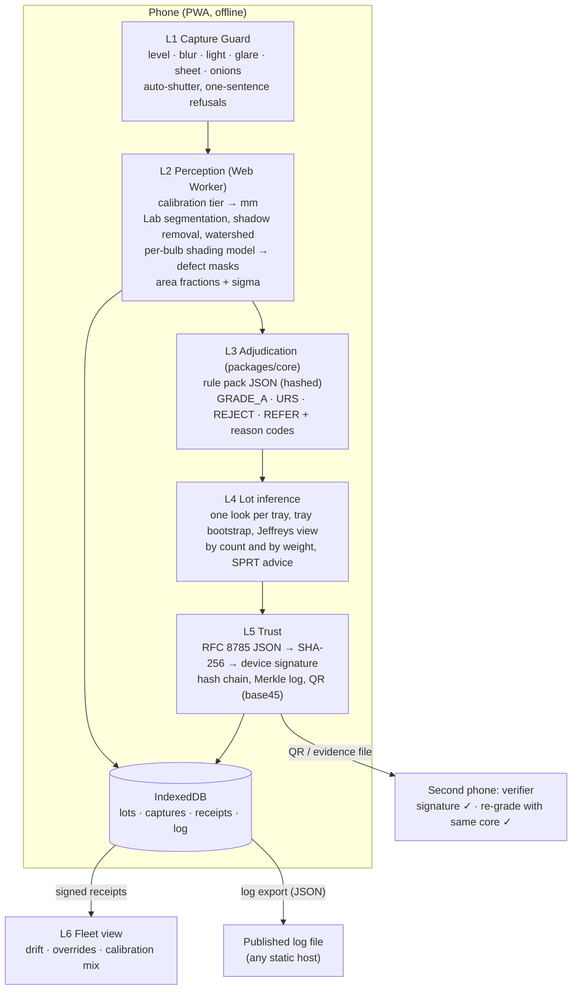

# Architecture

One TypeScript grading core is shared by the phone app, the verifier and the tests. Perception produces measurements with uncertainty; adjudication turns measurements into verdicts with integer arithmetic only, so every device reaches the same verdict.

## Layers and where they live

| Layer | Code | Notes |
|---|---|---|
| L1 Capture Guard | `packages/vision/src/quality.ts`, `apps/web/src/screens/Capture.tsx` | Runs on a 480 px preview about four times a second in the worker. Tilt comes from DeviceOrientation. The shutter fires after three consecutive all-green scans. |
| L2 Perception | `packages/vision/src/{pipeline,calib,morph,watershed,geom}.ts`, worker in `apps/web/src/workers/vision.worker.ts` | Pure TypeScript, no WASM needed. Every threshold is in `config.ts`; its canonical hash is the model hash printed on each receipt. |
| L3 Adjudication | `packages/core/src/adjudicate.ts`, `packages/core/packs/*.json` | A rule passes only if it passes at both ends of the measurement's interval (1.645 sigma, one-sided 95%). Undecided goes to REFER. |
| L4 Lot inference | `packages/core/src/{lot,stats,sampling}.ts` | Trays are clusters. Bootstrap resampling is seeded from the certificate, so intervals are reproducible. |
| L5 Trust | `packages/core/src/{canonical,hash,sign,merkle,certificate,compact,base45}.ts`, `apps/web/src/lib/lots.ts` | Ed25519 where the browser supports it, ECDSA P-256 otherwise. Keys are non-extractable CryptoKeys stored in IndexedDB. |
| L6 Fleet | `apps/web/src/screens/Fleet.tsx` | Built only from signed receipts. |

## Data that gets signed

A receipt is a `CertCore` (see `packages/core/src/certificate.ts`): lot metadata, capture mode and time, calibration tier, model id and hash, rule pack id and hash, sampling seed and drawn sacks, evidence hash (images and masks), every bulb's integer measurements, every human override or contest, a headline, and the hash of the full lot result. Revisions point to their parent; every receipt points to the previous receipt issued on that device. The QR carries the whole core (bulbs packed as 32-byte records, deflated, base45), so a verifier needs nothing else.

## Why these choices

- Area fractions instead of boxes, because the 2026 norms are written as shares of the bulb surface.
- Integer adjudication, because a verifier on a different phone must reproduce the verdict exactly.
- Rule packs as hashed data, because the norms changed twice in 2026 and will change again.
- No server in the demo path, because centres lose connectivity. A published log file is enough for after-the-fact audit.
- A colour model first, because there was no labelled field data. A learned model is added only where it beats the colour model on held-out real photos.
